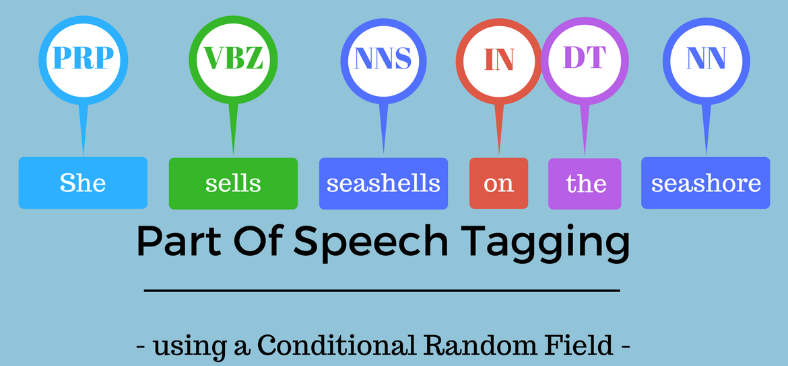

# Parts of Speech Tagging

This project will develop skills in part-of-speech (POS) tagging, the process of assigning a part-of-speech tag (Noun, Verb, Adjective...) to each word in an input text.  Tagging is difficult because some words can represent more than one part of speech at different times. They are  **Ambiguous**. Let's look at the following example: 

- The whole team played **well**. [adverb]
- You are doing **well** for yourself. [adjective]
- **Well**, this assignment took me forever to complete. [interjection]
- The **well** is dry. [noun]
- Tears were beginning to **well** in her eyes. [verb]

Distinguishing the parts-of-speech of a word in a sentence will help you better understand the meaning of a sentence. This would be critically important in search queries. Identifying the proper noun, the organization, the stock symbol, or anything similar would greatly improve everything ranging from speech recognition to search. By completing this assignment, we will: 

- Learn how parts-of-speech tagging works
- Compute the transition matrix A in a Hidden Markov Model
- Compute the emission matrix B in a Hidden Markov Model
- Compute the Viterbi algorithm 
- Compute the accuracy of your own model 
 

# Contents
0. Data Sources
1. POS Tagging
    - Training
        - create dictionaries
    - Testing
        - predict pos
2. Hidden Markov Models
    - Generating Matrices
        - create transition matrix
        - create emission matrix

3. Viterbi Algorithm
    - Initialization
    - Viterbi Forward
    - Viterbi Backward
4. Predicting on a data set
    - compute accuracy

# Credits

- NLP specialization by Deeplearning.ai on coursera